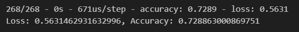
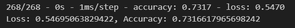
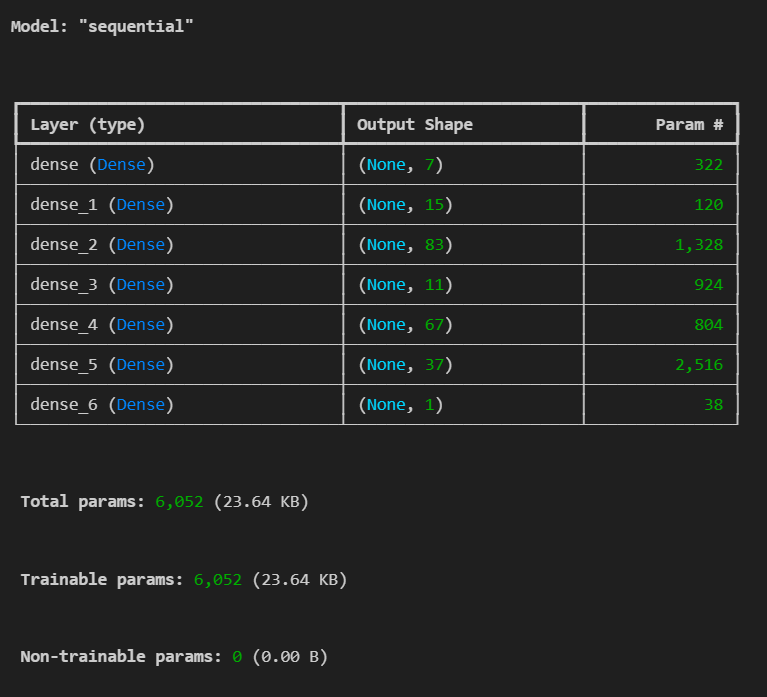
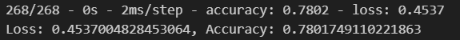

# Bryan Johnson's GWU Module 21 - Deep Learning Challenge READ ME File

## The files for this assignment can be found at the following repo:
https://github.com/bryanpijohnson/deep-learning-challenge

## Within the repo link, you will find the following folders and files to be reviewed and graded:

- **README.md** - that is this file :)
    - The report required for this assignment can be found at the bottom of this file.
- **AlphabetSoupCharity_Initial.ipynb** - this is the original Starter File, for which I created the initial analysis
- **AlphabetSoupCharity_Optimization1.ipynb** - this is the 1st optimization attempt, which uses the Keras Tuner to find the best model for the data, using the same pre-processed data from the initial file
- **AlphabetSoupCharity_Optimization2.ipynb** - this is the 2nd optimization attempt, which also uses the Keras Tuner to find the best model for the data, after pre-processing the data a different way
- **Resources** - folder that holds the following folders/files
    - **AlphabetSoupCharity.h5** - the saved model for the initial file
    - **AlphabetSoupCharity_Optimization1.h5** - the saved model for the Optimization1 file
    - **AlphabetSoupCharity_Optimization2.h5** - the saved model for the Optimization2 file
    - **Optimization_1** - the folder for all of the files for the Optimization1 file
    - **Optimization_2** - the folder for all of the files for the Optimization2 file

## Overview

The purpose of the analysis was to help create a tool for Alphabet Soup that can "help it select the applicants for funding with the best change of success in their ventures." We were given a CSV file of over 34,000 organizations have had been awarded funding from previous years, and whether or not the money was used effectively.

## Results

### Initial Run

#### Data Preprocessing

Initially, we were told to remove the `EIN` and `NAME` columns as there was a large amount of values in each of those columns and presumably, they wouldn't matter to the model. These were initially not considered features or targets.

I then looked at the other categorical columns and saw that 2 of them had more than 10 values: `APPLICATION_TYPE` and `CLASSIFICATION`. For both columns, I looked at the value counts and determined a cut-off value that we would rename as "Other". Here are the values that I chose for those columns:

- **APPLICATION_TYPE**: 500 entries or more
- **CLASSIFICATION**: 1000 entries or more

I then used `pd.get_dummies` to create the columns to translate the categorical columns to numerical. This gave me overall number of 44 columns. Using the `IS_SUCCESSFUL` column as the target, this left 43 columns for the features.

#### Compiling, Training, and Evaluating the Model

As we were initially instructed to use 2 hidden layers, I opted to use a large amount of nodes in each layer, specifically 80 nodes in the first layer and 30 nodes in the second layer.

Using the `binary_crossentropy` value for loss, the `adam` optimizer, and looking to maximize `accuracy`, I trained and then evaluated the model on the test data. This gave me an accuracy score of 72.89% with a 56.31% loss.

### Optimizing Runs

#### Data Preprocessing (Optimization1)

For the second round of models, my thought was to use the Keras Tuner to hopefully get better results. I used the exact same pre-processing as I had in the initial run, and thought that the Keras Tuner might do a better job of maximizing the accuracy on the data.

#### Compiling, Training, and Evaluating the Model

I used the same function that we created in class, but modified the values to allow for many more epochs for each of the runs. When it ran, it completed over 500 Trials and saved them in the Resources/Optimizer_1 folder. The loss was 54.70% and the accuracy was 73.17%.

The model that ended up getting used (e.g. the best model) is as follows:

---

#### Data Preprocessing (Optimization2)

I then realized that it wasn't the model that needed more tuning, but the pre-processing needed to be done better. I realized that not only did I bin too much of the categorical data, but I also should have kept the `NAME` column and binned that as well. (I considered keeping the `EIN` column, but each row had a unique value, and adding over 34K columns with only one 1 in each column was not something I wanted to do.)

I then updated the cut-off values for the bins for the following columns:

- **NAME**: 20 or fewer entries
- **APPLICATION_TYPE**: fewer than 10 entries
- **CLASSIFICATION**: fewer than 100 entries

This was a **massive** change from what I had done before.

#### Compiling, Training, and Evaluating the Model

I kept the exact same options in the Keras Tuner and ran the model. Doing so gave me an accuracy score of 78.02% and a loss of 45.37%.

The model that ended up getting used (e.g the best model) is as follows:

## Summary

Overall, I realized that the pre-processing is **just** as important to the process as is the actual model used. Since I had initially binned too much of the values in those columns, I lost a lot of important information, especially the `NAME` column. I also enjoyed using the Keras Tuner option as it helped me get to a much higher accuracy than I thought I would get, especially after the Optimization1 run.

While this model did do better than the 75% threshold required by the assignment, I would want to look for another kind of model that could possibly do better. I would likely not recommend using this model for this data. Perhaps, a Logistic model or something else might do better.

---

If you have any questions, please feel free to contact me.